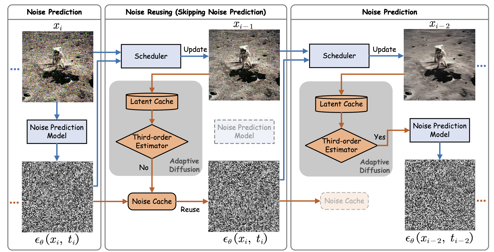
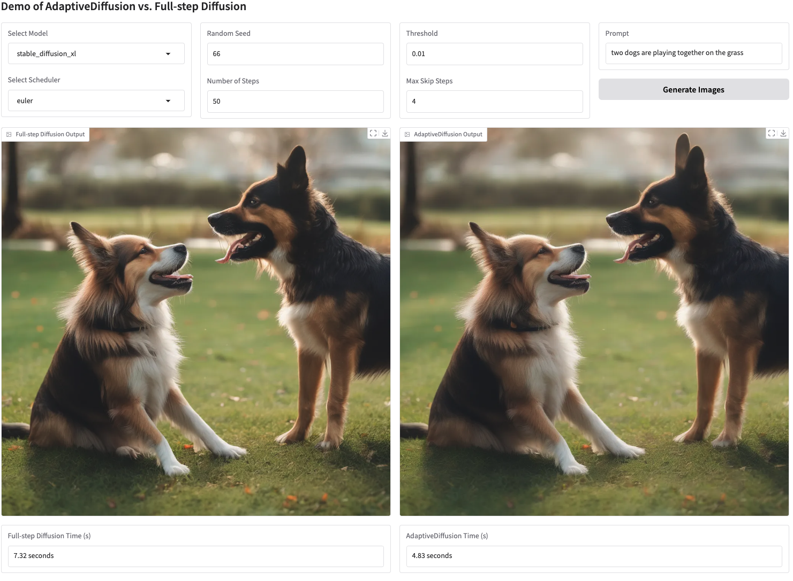

[](https://arxiv.org/abs/2410.09873)
[](https://github.com/UniModal4Reasoning/AdaptiveDiffusion/issues)
[](https://github.com/UniModal4Reasoning/AdaptiveDiffusion/pulls)

<div align="center">
<h1 style="text-align: center; font-size: 2.5rem; font-weight: bolders">
NeurIPS-2024: Training-free Adaptive Diffusion with Bounded Difference Approximation Strategy
</h1>


<font size=4>[[Paper]](https://arxiv.org/pdf/2410.09873)</font> &nbsp; &nbsp;<font size=4>[[Project page]](https://jiakangyuan.github.io/AdaptiveDiffusion-project-page/)</font> &nbsp;&nbsp;<font size=4>[[Huggingface]](https://huggingface.co/datasets/HankYe/Sampled_AIGCBench_text2image_ar_0.625)</font>
</div>

<p align="center">
    <br>
    
    <br>
<p>

## Introduction
This is the up-to-date official implementation of AdaptiveDiffusion in the paper, [**Training-free Adaptive Diffusion with Bounded Difference Approximation Strategy**](https://arxiv.org/abs/2410.09873). AdaptiveDiffusion is a novel adaptive inference paradigm containing a third-order latent differential estimator to determine whether to reuse the noise prediction from previous timesteps for the denoising of the current timestep. The developed skipping strategy adaptively approximates the optimal skipping strategy for various prompts based on the third-order latent differential value.

AdaptiveDiffusion offers three core components:

- Training-free adaptive diffusion acceleration [pipelines](https://github.com/UniModal4Reasoning/AdaptiveDiffusion/blob/master/examples/AdaptiveDiffusion/acceleration/sparse_pipeline.py) from the step number reduction of noise predictions that makes different skipping paths for different prompts.
- Unified skipping strategy for both image and video generation models.
- Interchangeable noise [schedulers](https://github.com/UniModal4Reasoning/AdaptiveDiffusion/blob/master/examples/AdaptiveDiffusion/generate.py) for different diffusion speeds and output quality.

## Installation

Please follow the [installation](https://github.com/huggingface/diffusers/blob/main/README.md) to complete the installation. If the evaluation is required, `cleanfid` and `calculate_fvd` should be installed for images and videos, respectively.

```
pip install cleanfid calculate_fvd
```

## Quickstart

Thanks to the unified inference pipelines in [diffusers](https://github.com/huggingface/diffusers), it is easy to deploy the third-order estimator on various diffusion pipelines to achieve adaptive diffusion.

### Step One
Select the target pipeline that you attempt to accelerate. For the comparison with original diffusion results, you can copy the [pipeline](https://github.com/UniModal4Reasoning/AdaptiveDiffusion/blob/master/src/diffusers/pipelines/) classes to [sparse_pipeline](https://github.com/UniModal4Reasoning/AdaptiveDiffusion/blob/master/examples/AdaptiveDiffusion/acceleration/sparse_pipeline.py).

### Step Two
Modify the pipeline you just copied into the [sparse_pipeline](https://github.com/UniModal4Reasoning/AdaptiveDiffusion/blob/master/examples/AdaptiveDiffusion/acceleration/sparse_pipeline.py). There are four places that need modification.

1. Pipeline Initialization
```python
class TargetPipeline(
    #... existing code...
):
    def __init__(
          #... existing code...
          threshold: float = 0.01, # default_threshold
          max_skip_steps: int = 4, # default max skipping time steps
        )
        #... existing code...
        self.prev_latents = []
        self.mask = []
        self.diff_list = []
        self.max_skip_steps = max_skip_steps
        self.threshold = threshold
```
2. `Estimator` function design and `Reset` function definition in the target class.
```python
class TargetPipeline(
    #... existing code...
):
    #... existing code...
    def estimate_skipping(self, latent):
        prev_latent = self.prev_latents[-1]
        
        prev_diff = self.diff_list[-1]
        prev_prev_diff = self.diff_list[-2]
        cur_diff = (latent - prev_latent).abs().mean()
        self.diff_list.append(cur_diff)
        if len(self.mask) > 4 and not any(self.mask[-self.max_skip_steps:]):
            return True
        if abs((cur_diff + prev_prev_diff) / 2 - prev_diff) <= prev_diff * self.threshold:
            return False
        return True

    def reset_cache(self):
        self.noise_pred = None
        self.prev_latents = []
        self.mask = []
        self.diff_list = []
      
    def __call__(
        #... existing code...
    ):
        #... existing code...
```
3. Replace the denoising code.
```python
class TargetPipeline(
    #... existing code...
):
    #... existing code...
    
    def __call__(
        #... existing code...
    ):
        #... existing code...

        with self.progress_bar(total=num_inference_steps) as progress_bar:
            #... existing code...
            # original: noise_pred = self.unet(...)
            # replaced with:
            ###### estimate whether to skip steps #######
            if len(self.prev_latents) <= 3:
                noise_pred = self.unet(...)[0]
                self.noise_pred = noise_pred
                if len(self.prev_latents) > 1:
                    self.diff_list.append((self.prev_latents[-1] - self.prev_latents[-2]).abs().mean())
            else:
                if self.mask[-1] == True:
                    noise_pred = self.unet(...)[0]
                    self.noise_pred = noise_pred
                else:
                    noise_pred = self.noise_pred
            #... existing code...
            latents = self.scheduler.step(...)[0]

            if len(self.prev_latents) >= 3:
                self.mask.append(self.estimate_skipping(latents))
            self.prev_latents.append(latents)
            #... existing code...
```
4. Modify the inference code.
```python
import sys
sys.path.append('/path/to/examples/AdaptiveDiffusion')
from acceleration.sparse_pipeline import TargetPipeline as AdaptiveTargetPipeline
import torch

threshold = 0.01
max_skip_steps = 4
pipeline = AdaptiveTargetPipeline.from_pretrained(..., threshold=threshold, max_skip_steps=max_skip_steps)
pipeline.scheduler = ... # in case you want to try more schedulers
pipeline.to("cuda")
pipeline("An image of a squirrel in Picasso style").images[0]
```
### Evaluation
To evaluate the generation quality of AdaptiveDiffusion, we follow [Distrifuser](https://github.com/mit-han-lab/distrifuser) to evaluate the generation similarity between the original and our adaptive diffusion model. After you generate all the images, you can use our script [`compute_metrics_image.py`](https://github.com/UniModal4Reasoning/AdaptiveDiffusion/blob/master/examples/AdaptiveDiffusion/compute_metrics_image.py) and [`compute_metrics_video.py`](https://github.com/UniModal4Reasoning/AdaptiveDiffusion/blob/master/examples/AdaptiveDiffusion/compute_metrics_video.py) to calculate PSNR, LPIPS and FID. The usage is
```python
python scripts/compute_metrics_image.py --input_root0 $IMAGE_ROOT0 --input_root1 $IMAGE_ROOT1
```
where `$IMAGE_ROOT0` and `$IMAGE_ROOT1` are paths to the image folders you are trying to compare.

### Evaluation on AIGCBench
For the evaluation on the image-to-video generation task, we randomly select 100 samples from the validation set of [AIGCBench](https://arxiv.org/abs/2401.01651). The sample list is provided in [Huggingface](HankYe/Sampled_AIGCBench_text2image_ar_0.625). After generating all the videos by [`generate_video.py`](https://github.com/UniModal4Reasoning/AdaptiveDiffusion/blob/master/examples/AdaptiveDiffusion/generate_video.py), you can use our script [`compute_metrics_video.py`](https://github.com/UniModal4Reasoning/AdaptiveDiffusion/blob/master/examples/AdaptiveDiffusion/compute_metrics_video.py) to calculate PSNR, LPIPS and FVD. The usage is 
```python
python scripts/compute_metrics_video.py --input_root0 $VIDEO_ROOT0 --input_root1 $VIDEO_ROOT1
```
where `$VIDEO_ROOT0` and `$VIDEO_ROOT1` are paths to the video folders you are trying to compare.

## Demo

You can also try our demo by 
```python
cd examples/AdaptiveDiffusion && python demo.py
```
Then, open the URL displayed in the terminal (For example, http://127.0.0.1:7860) and you can change the `model`, `seed`, `threshold`, and so on in the WebUI.

<p align="center">
    <br>
    
    <br>
<p>


## Citation

```bibtex
@misc{adaptivediffusion24ye,
  author = {Hancheng Ye and Jiakang Yuan and Renqiu Xia and Xiangchao Yan and Tao Chen and Junchi Yan and Botian Shi and Bo Zhang},
  title = {Training-Free Adaptive Diffusion with Bounded Difference Approximation Strategy},
  year = {2024},
  booktitle = {The Thirty-Eighth Annual Conference on Neural Information Processing Systems}
}
```


## Acknowledgements
We greatly acknowledge the authors of *Distrifuser*, *Torchsparse*, and *Diffusers* for their open-source codes. Visit the following links to access more contributions of them.

- [Distrifuser](https://github.com/mit-han-lab/distrifuser)
- [Torchsparse](https://github.com/mit-han-lab/torchsparse)
- [Diffusers](https://github.com/huggingface/diffusers)
